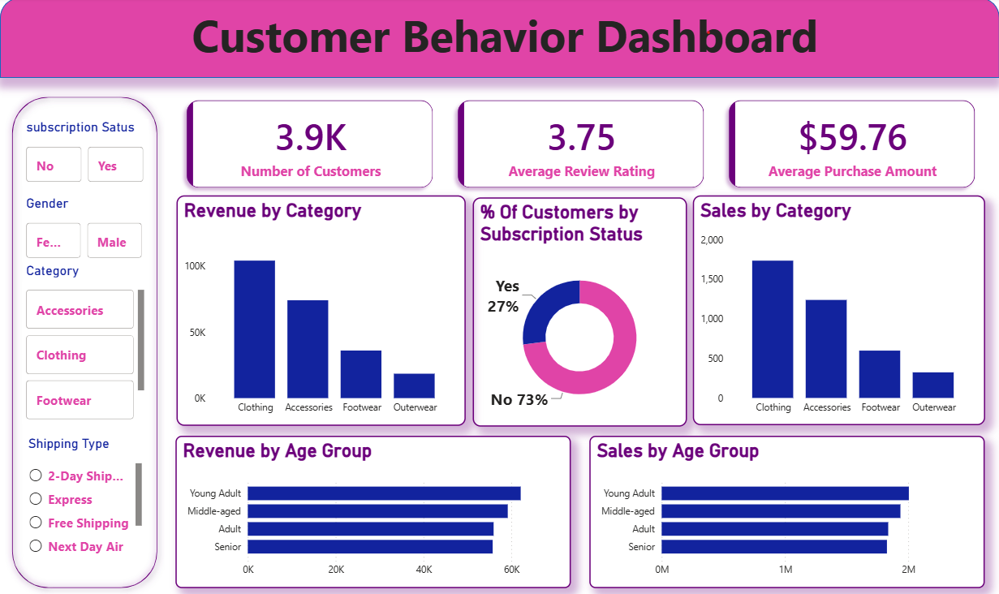

# 🛍️ Customer Shopping Behaviour Analysis

## 📌 Project Overview

**Customer Shopping Behaviour Analysis** is an end-to-end Data Analytics project focused on understanding customer purchasing patterns, preferences, spending behaviour, and shopping trends.

This project uses **Python, SQL, and Power BI** to clean, analyze, visualize, and transform customer shopping data into meaningful business insights.

The analysis helps identify customer preferences, purchasing trends, popular product categories, and factors that influence customer buying behaviour.

---

## 🎯 Objectives

- Analyze customer shopping and purchasing behaviour
- Understand customer demographics and preferences
- Identify popular product categories
- Analyze customer spending patterns
- Study the impact of discounts and subscriptions
- Analyze preferred payment methods
- Perform data cleaning and preprocessing
- Conduct Exploratory Data Analysis using Python
- Perform business analysis using SQL
- Create an interactive Power BI dashboard
- Generate useful business insights and recommendations

---

## 🛠️ Technologies & Tools

| Technology | Purpose |
|---|---|
| Python | Data Analysis and Preprocessing |
| Pandas | Data Manipulation |
| NumPy | Numerical Analysis |
| Matplotlib | Data Visualization |
| Seaborn | Statistical Visualization |
| SQL | Business Analysis |
| Power BI | Interactive Dashboard |
| Jupyter Notebook | Data Analysis and EDA |
| GitHub | Project Repository |

---

## 🔄 Project Workflow

Raw Dataset

     ↓
     
Data Understanding

     ↓
     
Data Cleaning & Preprocessing

     ↓
     
Exploratory Data Analysis

     ↓
     
Customer Behaviour Analysis

     ↓
     
SQL Business Analysis

     ↓
     
Power BI Dashboard

     ↓
     
Business Insights

     ↓
     
Recommendations

---

## 🐍 Python Data Analysis

Python is used for data cleaning, preprocessing, exploratory data analysis, statistical analysis, and visualization.

### Key Activities

- Importing and understanding the dataset
- Checking dataset structure and data types
- Identifying missing values
- Checking and handling duplicate records
- Data cleaning and preprocessing
- Descriptive statistical analysis
- Customer demographic analysis
- Product category analysis
- Purchase behaviour analysis
- Spending pattern analysis
- Data visualization
- Generating meaningful insights

### Python Libraries

    import pandas as pd
    import numpy as np
    import matplotlib.pyplot as plt
    import seaborn as sns

---

## 🗄️ SQL Analysis

SQL is used to perform business-oriented analysis and answer important questions related to customer shopping behaviour.

### SQL Analysis Includes

- Customer purchasing behaviour
- Product category performance
- Purchase amount analysis
- Customer demographic analysis
- Discount analysis
- Subscription behaviour
- Payment method analysis
- Customer spending patterns
- Shopping trends
- Customer segmentation analysis

### SQL Query File

The complete SQL queries are available in:

    SQL/Customer_Behaviour_SQL_Queries.sql

---

## 📸 SQL Query Outputs

The following screenshots show the outputs generated from the MySQL business analysis queries.

### Q1. Revenue by Gender

#### SQL Query

    SELECT 
        gender,
        SUM(purchase_amount) AS revenue
    FROM customer
    GROUP BY gender;

#### Output

---

### Q2. Customers Who Used Discount but Spent Above Average

#### SQL Query

    SELECT 
        customer_id,
        purchase_amount
    FROM customer
    WHERE discount_applied = 'Yes'
    AND purchase_amount >= (
        SELECT AVG(purchase_amount)
        FROM customer
    );

#### Output

---

### Q3. Top 5 Products with Highest Average Review Rating

#### SQL Query

    SELECT 
        item_purchased,
        ROUND(AVG(review_rating), 2) AS average_product_rating
    FROM customer
    GROUP BY item_purchased
    ORDER BY average_product_rating DESC
    LIMIT 5;

#### Output

---

### Q4. Category Analysis

#### Output

---

## 📊 Power BI Dashboard

An interactive Power BI dashboard was developed to provide a visual overview of customer shopping behaviour and business performance.

### Dashboard Features

- Customer overview
- Purchase analysis
- Product category analysis
- Customer demographic analysis
- Spending analysis
- Subscription analysis
- Discount analysis
- Payment method analysis
- Interactive filters
- Charts and KPIs
- Business performance insights

---

## 🖼️ Dashboard Preview

### Main Dashboard

### Dashboard Overview

### Sales Analysis

### Customer Analysis

---

## 📊 Power BI File

The complete Power BI dashboard file is available in:

    Dashboard/customer_behavior_dashboard_powerbi.pbix

---

## 📈 Key Business Insights

The analysis focuses on identifying important customer and business insights, including:

- High-value customer segments
- Popular product categories
- Customer purchasing patterns
- Customer spending behaviour
- Impact of discounts on purchasing decisions
- Relationship between subscriptions and customer behaviour
- Preferred payment methods
- Customer demographic trends
- Purchase frequency patterns
- Opportunities for improving customer engagement and sales

---

## 💡 Business Recommendations

Based on the analysis, businesses can:

- Develop targeted marketing campaigns
- Focus on high-value customer segments
- Promote popular product categories
- Provide personalized offers
- Optimize discount strategies
- Improve customer retention
- Encourage subscription programs
- Understand customer preferences
- Improve product marketing strategies
- Use data-driven insights for business decision-making

---

## 📑 Project Report

A detailed project report is included in the repository.

The report covers:

- Project Introduction
- Problem Statement
- Project Objectives
- Dataset Description
- Data Preprocessing
- Exploratory Data Analysis
- Python Analysis
- SQL Analysis
- Power BI Dashboard
- Key Findings
- Business Insights
- Recommendations
- Conclusion

### Report File

    Report/Customer_Shopping_Behaviour_Analysis_Report.pdf

---

## 🚀 How to Run the Project

### 1. Clone the Repository

    git clone https://github.com/Adithyasajeev22/Customer-Shopping-Behaviour-Analysis.git

### 2. Navigate to the Project Folder

    cd Customer-Shopping-Behaviour-Analysis

### 3. Install Required Libraries

    pip install pandas numpy matplotlib seaborn jupyter

### 4. Open the Jupyter Notebook

Open the following file using Jupyter Notebook, JupyterLab, or VS Code:

    Customer_Shopping_Behavior_Analysis.ipynb

### 5. Run the Analysis

Execute the notebook cells sequentially to perform:

- Data loading
- Data cleaning
- Data preprocessing
- Exploratory Data Analysis
- Data visualization
- Customer behaviour analysis

### 6. Run SQL Queries

Open the SQL file:

    SQL/Customer_Behaviour_SQL_Queries.sql

Execute the queries using MySQL Workbench or your preferred SQL environment.

### 7. Open the Power BI Dashboard

Open the following file using Microsoft Power BI Desktop:

    Dashboard/customer_behavior_dashboard_powerbi.pbix

---

## 📁 Project Components

| Component | Description |
|---|---|
| 📊 Dataset | Customer shopping behaviour dataset |
| 🐍 Python Notebook | Data cleaning, EDA, analysis and visualization |
| 🗄️ SQL Queries | Business-oriented customer analysis |
| 📈 Power BI Dashboard | Interactive visualization and reporting |
| 📋 Problem Statement | Defines the business problem |
| 📑 Project Report | Complete project documentation |
| 🖼️ Screenshots | Dashboard and SQL output screenshots |

---

## 🎓 Skills Demonstrated

### Programming & Data Analysis

- Python
- Pandas
- NumPy
- Matplotlib
- Seaborn
- Data Cleaning
- Data Preprocessing
- Exploratory Data Analysis
- Statistical Analysis

### SQL & Database

- SQL
- MySQL
- Business Query Development
- Data Aggregation
- Filtering
- Grouping
- Subqueries
- Business Analysis

### Business Intelligence

- Power BI
- Dashboard Development
- KPI Creation
- Data Visualization
- Interactive Reports
- Business Intelligence
- Data Storytelling

### Other Skills

- Customer Behaviour Analysis
- Insight Generation
- Business Recommendations
- Data-driven Decision Making
- Git
- GitHub

---

## 🔮 Future Scope

The project can be further enhanced by implementing:

- Customer segmentation using Machine Learning
- Customer purchase prediction
- Customer churn prediction
- Product recommendation systems
- Customer Lifetime Value prediction
- Advanced customer segmentation
- Automated Power BI dashboard refresh
- Predictive customer analytics

---

## 👨‍💻 Author

### Adithya V S

**Data Analytics | Python | SQL | Power BI | Data Visualization**

### GitHub

https://github.com/Adithyasajeev22

### Project Repository

https://github.com/Adithyasajeev22/Customer-Shopping-Behaviour-Analysis

---

## ⭐ Support

If you find this project useful, please consider giving the repository a ⭐ on GitHub.

Thank you for visiting this project! 🙌
